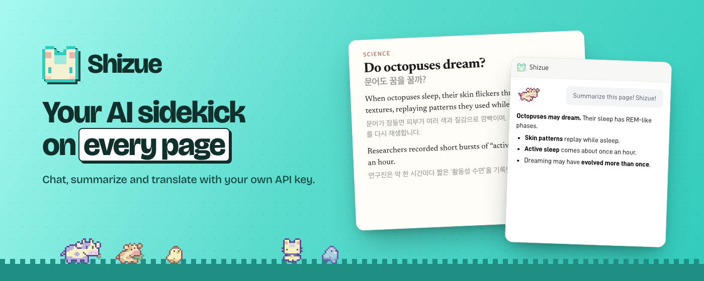
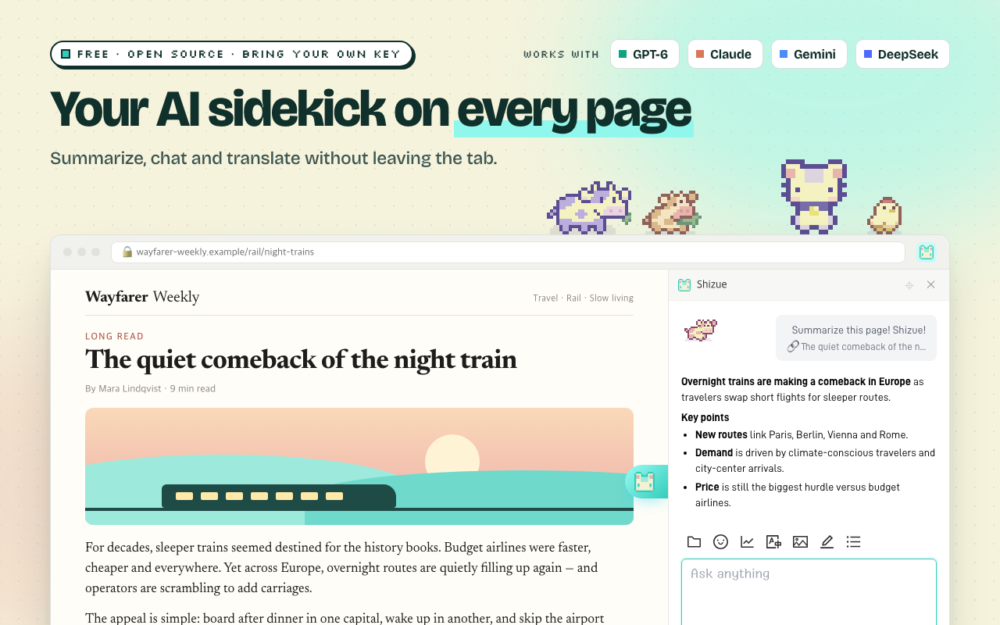
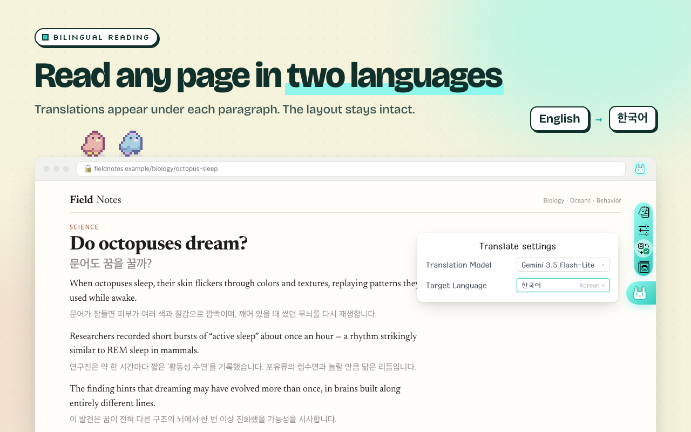
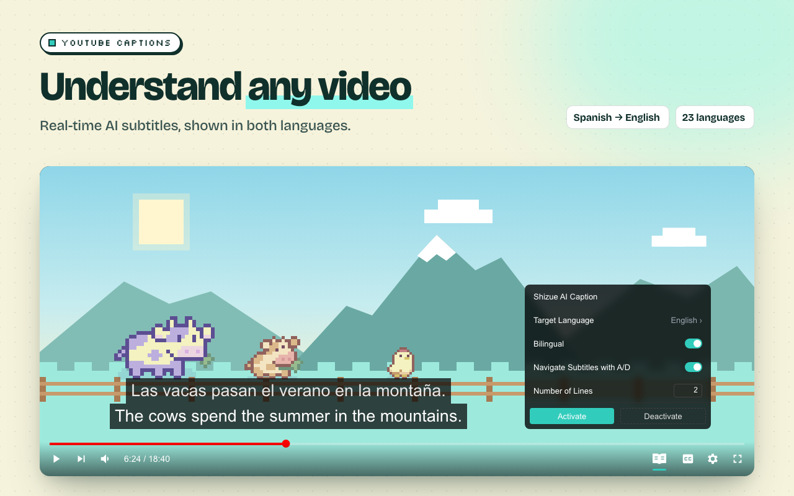
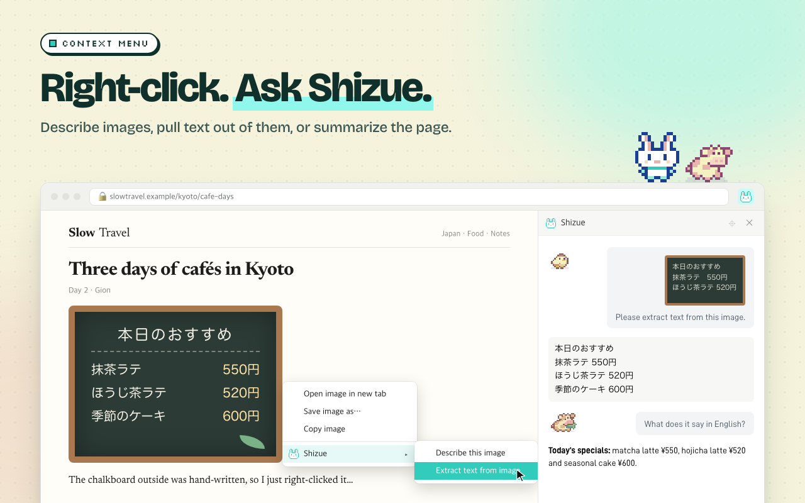
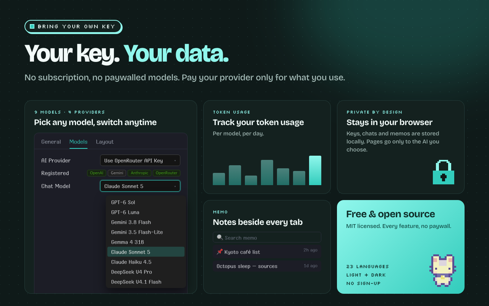

<div align="center">
  
  <h1>Shizue</h1>
  <p>Supercharge your Browse experience with the power of LLMs</p>


  <p>
    <a style="font-size: 28px" href="https://chromewebstore.google.com/detail/mpcbgfkoholfgapcgcmfjobnfcbnfanm?utm_source=item-share-cb">
      Download Shizue from Chrome Web Store
    </a>
  </p>

  <p>
    <a href="https://chromewebstore.google.com/detail/mpcbgfkoholfgapcgcmfjobnfcbnfanm"></a>
    <a href="https://chromewebstore.google.com/detail/mpcbgfkoholfgapcgcmfjobnfcbnfanm/reviews"></a>
    <a href="LICENSE"></a>
  </p>
</div>

# 👋 Intro

Shizue is a Chrome extension designed for integrating Large Language Models (LLMs) into the daily Browse workflow. The project aims to enhance browser interactions with LLM-driven features, conceptually similar to how tools like Cursor augment code editors.

Shizue provides a free, open-source alternative to commercial services (e.g., [Sider](https://sider.ai/pricing)) that **restricts access to newer models or handy services** behind additional paywalls. Shizue enables users to utilize their own API keys for direct access to rich LLM functionalities, such as page summarization and bilingual webpage translation.

<br/>

# 🌟 Features


### 💬 AI Chat Sidebar:
  - Quickly launch the sidebar using a keyboard shortcut (default: Ctrl/Cmd+Shift+E) to interact with LLMs via a side panel for queries, brainstorming, or information retrieval without navigating away from the current page.

<p align="center">
  
</p>

### 🌐 Bilingual Reading:
  - View web content in two languages side-by-side, aiding in language learning or comprehension of foreign-language texts.

<p align="center">
  
</p>

### 📺 LLM Translations for Youtube Captions:
  - Generate LLM based translations for Youtube captions in realtime.

<p align="center">
  
</p>

### 📝 Memo & Note-taking:
  - Create, edit, and manage personal notes directly within the extension. Features auto-save, pinning important memos, and organized note management.

### 📄 One-Click Page Summaries:
  - Generate concise summaries of web pages for quick content overview.

### 🖱️ Context Menu Actions:
  - Right-click on any page to translate or summarize it instantly
  - Right-click on images to describe their content or extract text (OCR) using AI

<p align="center">
  
</p>

### 🌍 Multi-language Support:
  - Available in 23 languages including English, Spanish, French, German, Japanese, Chinese, Korean, Arabic, Hindi, and more.

### 🤖 Multiple AI Model Support:
  - **OpenAI**: GPT-6 Sol, GPT-6 Luna
  - **Google**: Gemini 3.8 Flash, Gemini 3.5 Flash-Lite
  - **Anthropic**: Claude Sonnet 5, Claude Haiku 4.5
  - **DeepSeek** (OpenRouter only): DeepSeek V4 Pro, DeepSeek V4.1 Flash
  - **OpenRouter**: all of the above with a single API key

### 🔑 Use Your Own API Keys:
  - Supports personal OpenAI/Gemini/Anthropic API keys for direct and the most cost-effective usage of models. Users are billed directly by those vendors.
  - Or use one OpenRouter API key for every model, billed by OpenRouter.

<p align="center">
  
</p>

### 🎨 Color Themes:
  - Offers Light and Dark mode options for interface customization.

### 🛡️ Secure & Private:
  - API keys, chat history, and memos are stored only in your browser. Page content is sent only to the AI provider you choose, when you use a feature.

<br/>

# 🔍 Transparency & FAQ

**Is it really free?**
Yes, and it will stay free. There is no paid plan, no account, and no ads. You pay only your AI provider (or OpenRouter) for the API calls you make. The Token Usage chart (the chart button below the chat box) shows how many tokens each model used.

**Is the whole thing open source?**
Yes. The full source of the extension is in this repository under the [MIT License](LICENSE). The repository was private for a period after mid-2025 and is public again. It was AGPL-3.0 from June 2025 to October 2026 and is MIT as of v0.2.9. The PDF translation feature, which was built on AGPL-licensed BabelDOC, has been removed.

**Does Shizue have a server? What leaves my browser?**
There is no Shizue server. API keys, chat history, memos, and settings stay in your browser's storage. When you use a feature, only the content that feature needs (e.g. the page text for a summary) is sent directly from your browser to the provider you chose, or to OpenRouter. There is no analytics or tracking. Details are in the [privacy policy](privacy_policy.md).

**What does OpenRouter see about Shizue?**
Requests to OpenRouter carry `HTTP-Referer: https://shizue.net` and `X-OpenRouter-Title: Shizue`, so OpenRouter counts the usage under the Shizue app. These headers identify the app, not you, and nothing is sent to shizue.net.

**Why these permissions?**
- `storage`: keep your keys, settings, and history locally
- `sidePanel`: the chat side panel
- `activeTab`: work with the tab you're on when you open Shizue or use a right-click action
- `contextMenus`: the right-click actions
- Content scripts on all sites: the floating toggle button and page translation; on YouTube, the caption translation

**Local models (Ollama) or Firefox?**
Not yet.

<br/>

# 🔀 Using Shizue with OpenRouter

One [OpenRouter](https://openrouter.ai) key gives you every model in Shizue, including DeepSeek, which is available only through OpenRouter.

1. Create a key at [openrouter.ai/keys](https://openrouter.ai/keys).
2. In Shizue's onboarding, choose **Use OpenRouter API Key** and paste it. Later you can change it in Settings → Models → AI Provider.
3. If you also register a provider's own key (OpenAI, Gemini, or Anthropic), its models use that key directly. Check **Prefer OpenRouter** to send them through OpenRouter instead.

<br/>

# 🐳 Installation

- You can install Shizue from [Chrome Web Store](https://chromewebstore.google.com/detail/mpcbgfkoholfgapcgcmfjobnfcbnfanm?utm_source=item-share-cb),
- or you can install Shizue manually from the source by following these steps:

### Manual Install (for Developers):

1.  **Clone & Setup:**
    ```bash
    # Ensure pnpm is installed (npm i -g pnpm)
    git clone https://github.com/rokrokss/shizue && cd shizue
    pnpm install
    ```

2.  **Build:**
    ```bash
    pnpm build # For production build
    # Or use `pnpm dev` for development with hot-reloading
    ```

3.  **Load in Chrome:**
    * Go to `chrome://extensions`.
    * Enable "Developer mode".
    * Click "Load unpacked" and select the build output directory (`dist/chrome-mv3/`).

<br/>

# 💬 Community & Feedback

For suggestions, feedback, or discussions, join me on [Discord](https://discord.gg/ukfPmxsyEy).

<br/>

# 📄 License

[MIT](LICENSE)
