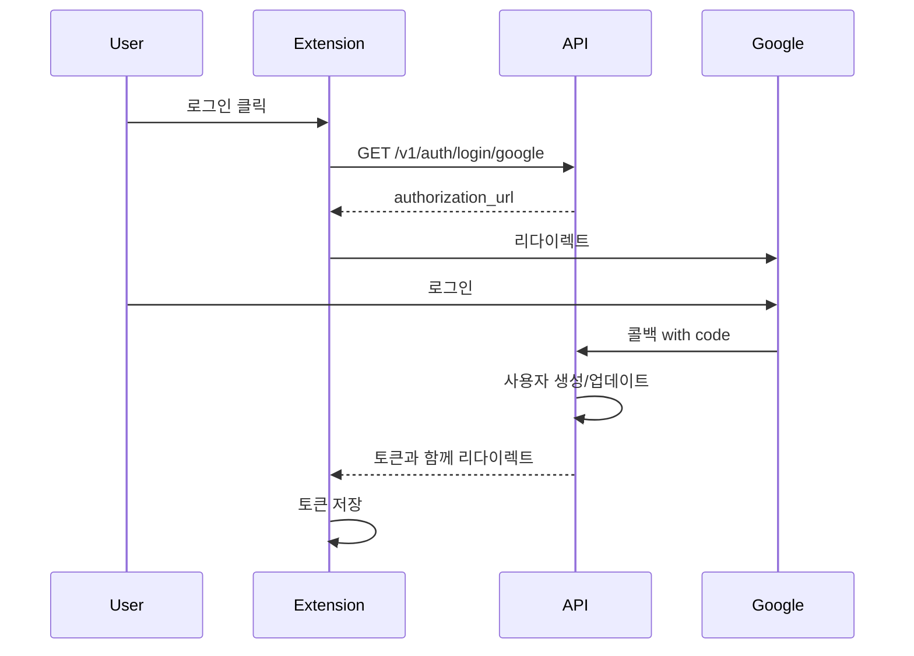

# Shizue Accounts API 가이드

## 목차

1. [시작하기](#시작하기)
2. [인증](#인증)
3. [API 엔드포인트](#api-엔드포인트)
4. [에러 처리](#에러-처리)
5. [사용 예제](#사용-예제)

## 시작하기

### Base URL

- 개발: `http://localhost:8000`
- 프로덕션: `https://api.shizue.app`

### 인증 흐름



## 인증

### 1. Google OAuth 로그인

```bash
GET /v1/auth/login/google
```

**응답:**
```json
{
  "authorization_url": "https://accounts.google.com/o/oauth2/v2/auth?..."
}
```

### 2. OAuth 콜백 처리

```bash
GET /v1/auth/callback/google?code={code}&state={state}
```

성공 시 Chrome Extension으로 리다이렉트:
```
chrome-extension://{extension_id}/callback?access_token={token}&refresh_token={token}
```

### 3. 토큰 갱신

```bash
POST /v1/auth/refresh
Content-Type: application/json

{
  "refresh_token": "your_refresh_token"
}
```

**응답:**
```json
{
  "access_token": "new_access_token",
  "refresh_token": "same_refresh_token",
  "token_type": "Bearer",
  "expires_in": 1800
}
```

### 4. 로그아웃

```bash
POST /v1/auth/logout?refresh_token={token}
```

## API 엔드포인트

### 사용자 관리

#### 현재 사용자 정보

```bash
GET /v1/users/me
Authorization: Bearer {access_token}
```

**응답:**
```json
{
  "id": "123e4567-e89b-12d3-a456-426614174000",
  "google_id": "1234567890",
  "email": "user@example.com",
  "name": "John Doe",
  "profile_picture": "https://example.com/photo.jpg",
  "locale": "en",
  "is_active": true,
  "is_premium": false,
  "created_at": "2024-01-01T00:00:00Z",
  "last_login_at": "2024-01-01T12:00:00Z"
}
```

#### 프로필 업데이트

```bash
PATCH /v1/users/me
Authorization: Bearer {access_token}
Content-Type: application/json

{
  "name": "New Name",
  "locale": "ko"
}
```

#### 사용 통계

```bash
GET /v1/users/me/stats
Authorization: Bearer {access_token}
```

**응답:**
```json
{
  "total_messages": 150,
  "total_tokens": 45000,
  "models_used": {
    "gpt-4": 25000,
    "claude-3": 20000
  },
  "last_30_days": {
    "daily_usage": [
      {
        "date": "2024-01-01",
        "messages": 10,
        "tokens": 3000
      }
    ]
  }
}
```

### 사용량 추적

#### 사용량 기록

```bash
POST /v1/usage/
Authorization: Bearer {access_token}
Content-Type: application/json

{
  "model": "gpt-4-turbo",
  "endpoint": "/v1/chat/completions",
  "tokens_input": 150,
  "tokens_output": 350,
  "latency_ms": 1200,
  "status_code": 200,
  "metadata": {
    "temperature": 0.7,
    "max_tokens": 500
  }
}
```

#### 사용 내역 조회

```bash
GET /v1/usage/?limit=10&offset=0&model=gpt-4
Authorization: Bearer {access_token}
```

#### 사용량 요약

```bash
GET /v1/usage/summary?period=month
Authorization: Bearer {access_token}
```

**응답:**
```json
{
  "period": "month",
  "total_messages": 150,
  "total_tokens": 45000,
  "models": {
    "gpt-4": {
      "messages": 50,
      "tokens": 25000
    },
    "claude-3": {
      "messages": 100,
      "tokens": 20000
    }
  },
  "daily_breakdown": [
    {
      "date": "2024-01-01",
      "messages": 10,
      "tokens": 3000
    }
  ]
}
```

## 에러 처리

모든 에러는 일관된 형식으로 반환됩니다:

```json
{
  "detail": "Error message",
  "status_code": 400,
  "timestamp": "2024-01-01T00:00:00Z",
  "request_id": "123e4567-e89b-12d3-a456-426614174000"
}
```

### 일반적인 에러 코드

- `401 Unauthorized`: 인증 필요 또는 토큰 만료
- `403 Forbidden`: 권한 없음
- `404 Not Found`: 리소스를 찾을 수 없음
- `422 Unprocessable Entity`: 유효성 검사 실패
- `429 Too Many Requests`: Rate limit 초과
- `500 Internal Server Error`: 서버 오류

## 사용 예제

### JavaScript/TypeScript (Chrome Extension)

```typescript
// 로그인
async function login() {
  const response = await fetch('http://localhost:8000/v1/auth/login/google');
  const { authorization_url } = await response.json();
  
  // 새 탭에서 Google 로그인
  chrome.tabs.create({ url: authorization_url });
}

// API 호출
async function getUserProfile(accessToken: string) {
  const response = await fetch('http://localhost:8000/v1/users/me', {
    headers: {
      'Authorization': `Bearer ${accessToken}`
    }
  });
  
  if (!response.ok) {
    throw new Error('Failed to fetch profile');
  }
  
  return response.json();
}

// 토큰 갱신
async function refreshToken(refreshToken: string) {
  const response = await fetch('http://localhost:8000/v1/auth/refresh', {
    method: 'POST',
    headers: {
      'Content-Type': 'application/json'
    },
    body: JSON.stringify({ refresh_token: refreshToken })
  });
  
  if (!response.ok) {
    throw new Error('Failed to refresh token');
  }
  
  return response.json();
}

// 사용량 기록
async function recordUsage(accessToken: string, usage: any) {
  const response = await fetch('http://localhost:8000/v1/usage/', {
    method: 'POST',
    headers: {
      'Authorization': `Bearer ${accessToken}`,
      'Content-Type': 'application/json'
    },
    body: JSON.stringify(usage)
  });
  
  if (!response.ok) {
    throw new Error('Failed to record usage');
  }
  
  return response.json();
}
```

### Python 예제

```python
import requests
from typing import Dict, Any

BASE_URL = "http://localhost:8000"

class ShizueAPI:
    def __init__(self, access_token: str = None):
        self.access_token = access_token
        self.session = requests.Session()
        if access_token:
            self.session.headers.update({
                "Authorization": f"Bearer {access_token}"
            })
    
    def login_google(self) -> str:
        """Get Google OAuth login URL"""
        response = self.session.get(f"{BASE_URL}/v1/auth/login/google")
        response.raise_for_status()
        return response.json()["authorization_url"]
    
    def refresh_token(self, refresh_token: str) -> Dict[str, Any]:
        """Refresh access token"""
        response = self.session.post(
            f"{BASE_URL}/v1/auth/refresh",
            json={"refresh_token": refresh_token}
        )
        response.raise_for_status()
        data = response.json()
        
        # Update session with new token
        self.access_token = data["access_token"]
        self.session.headers.update({
            "Authorization": f"Bearer {self.access_token}"
        })
        
        return data
    
    def get_profile(self) -> Dict[str, Any]:
        """Get current user profile"""
        response = self.session.get(f"{BASE_URL}/v1/users/me")
        response.raise_for_status()
        return response.json()
    
    def record_usage(self, model: str, tokens_in: int, tokens_out: int) -> Dict[str, Any]:
        """Record API usage"""
        response = self.session.post(
            f"{BASE_URL}/v1/usage/",
            json={
                "model": model,
                "endpoint": "/v1/chat/completions",
                "tokens_input": tokens_in,
                "tokens_output": tokens_out,
                "status_code": 200
            }
        )
        response.raise_for_status()
        return response.json()

# 사용 예제
api = ShizueAPI()

# 로그인
login_url = api.login_google()
print(f"Login URL: {login_url}")

# 토큰이 있는 경우
api = ShizueAPI(access_token="your_access_token")
profile = api.get_profile()
print(f"User: {profile['name']} ({profile['email']})")

# 사용량 기록
usage = api.record_usage("gpt-4", 100, 200)
print(f"Usage recorded: {usage['id']}")
```

## Rate Limiting

API는 다음과 같은 rate limit을 적용합니다:

- **인증된 사용자**: 분당 100 요청
- **인증되지 않은 사용자**: 분당 10 요청

Rate limit 헤더:
- `X-RateLimit-Limit`: 제한
- `X-RateLimit-Remaining`: 남은 요청 수
- `X-RateLimit-Reset`: 리셋 시간 (Unix timestamp)

## 웹훅 (향후 지원 예정)

향후 다음과 같은 이벤트에 대한 웹훅을 지원할 예정입니다:

- 사용량 임계값 도달
- 계정 상태 변경
- 구독 상태 변경